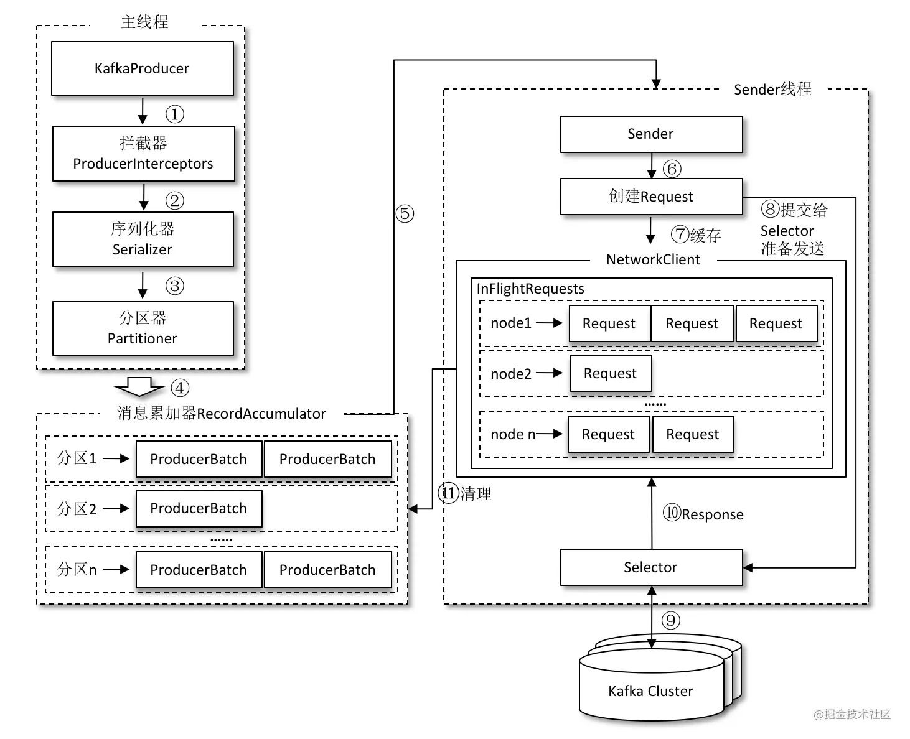

# kafka

### 基础
1. 结构组成
    - Producer 生产者
    - Consumer 消费者
    - Broker 服务代理节点,负责收到消息存储到磁盘
    - ZK 负责集群中元数据管理,控制器的选举
2. 重要概念
    - Topic(主题)kafka消息以主题为单位进行归类 
    - Partition(分区)为Topic子逻辑,一个主题有多个分区,一个主题下分区消息不同,分区在存储层面可以看作一个可追加的Log,消息  
    在被追加到分区时,会为其增加一个特定的偏移量(offset) 
    - Offset(消息分区中的唯一标识),kafka用其来保证[分区]的有序
    - Replica(副本) 同一分区有不同副本,leader负责处理读写,follower只负责同步
    - HD(高水位) 标识一个特定的offset,在他之前的消息对消费者才是可见的,消费者某个时间内不一定能知道全部从生产者发送的消息  
    多副本下,副本最低的LEO即为HD,所以副本同步速度会影响消费速度(同步情况)
    - LEO 下一条消息写入的offset  
3. docker安装
    - ZK
        ``` 
        docker pull wurstmeister/zookeeper
        docker run -d --name zookeeper -p 2181:2181 -v /etc/localtime:/etc/localtime wurstmeister/zookeeper
        ```    
    - kafka
        ``` 
        docker pull wurstmeister/kafka
        # -e KAFKA_BROKER_ID=0  在kafka集群中，每个kafka都有一个BROKER_ID来区分自己
        # -e KAFKA_ZOOKEEPER_CONNECT=192.168.155.56:2181/kafka 配置zookeeper管理kafka的路径192.168.155.56:2181/kafka
        # -e KAFKA_ADVERTISED_LISTENERS=PLAINTEXT://192.168.155.56:9092  把kafka的地址端口注册给zookeeper
        # -e KAFKA_LISTENERS=PLAINTEXT://0.0.0.0:9092 配置kafka的监听端口
        # -v /etc/localtime:/etc/localtime 容器时间同步虚拟机的时间
        docker run -d --name kafka  -p 9092:9092 -e KAFKA_BROKER_ID=0 -e KAFKA_ZOOKEEPER_CONNECT=81.68.186.201:2181/kafka -e KAFKA_ADVERTISED_LISTENERS=PLAINTEXT://81.68.186.201:9092 -e KAFKA_LISTENERS=PLAINTEXT://0.0.0.0:9092 -v /etc/localtime:/etc/localtime wurstmeister/kafka
        ```    
    - ZK查看是否注册上去
        ```
        docker exec -it zookeeper /bin/sh
        ./zkCli.sh
        cd bin/
        ls / 
        ```    
4. 命令
    1. 创建topic
        ``` 
        --zookeeper 指定了 Kafka 所连接的 ZooKeeper 服务地址
        --topic 指定了所要创建主题的名称
        --replication-factor 指定了副本因子
        --partitions 指定了分区个数
        --create 是创建主题的动作指令
        
        ./kafka-topics.sh --zookeeper 81.68.186.201:2181/kafka --create --topic topic-demo --replication-factor 1 --partitions 1
        ```
    2. 发送消息
        ``` 
        --broker-list 指定了连接的 Kafka 集群地址
        --topic 指定了发送消息时的主题
        ./kafka-console-producer.sh --broker-list localhost:9092 --topic topic-demo
        ``` 
    3. 接受消息
        ``` 
         --bootstrap-server 指定了连接的 Kafka 集群地址
         --topic 指定了消费者订阅的主题
        ./kafka-console-consumer.sh --bootstrap-server localhost:9092 --topic topic-demo
        ```    
5. 生产者消息在通过 send() 方法发往 broker 的过程中，有可能需要经过拦截器（Interceptor）、序列化器（Serializer）和分区器（Partitioner）  
的一系列作用之后才能被真正地发往broker。
    - 拦截器一共有两种拦截器：生产者拦截器和消费者拦截器
        * 生产者拦截器的使用也很方便，主要是自定义实现 org.apache.kafka.clients.producer.ProducerInterceptor 接口
            1. kafka会在序列化和分区前调用onSend方法
            2. KafkaProducer 会在消息被应答之前或消息发送失败时调用onAcknowledgement方法
            3. close() 方法主要用于在关闭拦截器时执行一些资源的清理工作
        * 实现自定义拦截器需要在配置中注册map.put(ProducerConfig.INTERCEPTOR_CLASSES_CONFIG,MyProducerInterceptor.class.getName()+",
        "+..其余拦截器);
    - 默认序列化器为org.apache.kafka.common.serialization.StringSerializer,很单纯的把字符串转为byte[] 
    - 分区器如果入参默认带了分区就不执行,不然会计算一个int的分区号
6. 客户端由两个线程协调,这两个线程分别为主线程和Sender(发送线程)
    - 在主线程中由 KafkaProducer 创建消息，然后通过可能的拦截器、序列化器和分区器的作用之后缓存到消息累加器（也称为消息收集器）中
        * 消息累加器分为多个消息包(ProducerBatch),每个消息包里包含多个消息,发送消息以消息包的形式发送,减少网络请求次数
    - Sender 线程负责从 消息累加器 中获取消息并将其发送到 Kafka 中
    - 消息在发送前需要创建一块内存来保存对应的消息,在客户端中,kafka专门BufferPool来存放,来对消息(byte[])进行存放(复用),而对
    消息大于BufferPool的消息并不会复用,所以适当的扩大BufferPool来提高复用
           
    - Sender线程会从消息收集器中获取缓存消息,转化为<Node,Request>的形式,在往kafka发送前还会保存到InFlightRequests中
        * 其中 Node 表示 Kafka 集群的 broker 节点。对于网络连接来说，生产者客户端是与具体的 broker 节点建立的连接，也就是向具体的 broker 节点发送消息，
        而并不关心消息属于哪一个分区,但是需要知道目标分区的 leader 副本所在的 broker 节点的地址、端口等信息才能建立连接
        * Request包含List<消息包>,kafka各种协议的请求
        * InFlightRequests主要缓存已经发送但是没有收到响应的请求,他可以限制连接Node的个数,最大的缓存数,当超过最大缓存数后,不能向该连接
        发送请求,可以通过队列数量和最大缓存值判断节点负载较大或网络连接有问题 
    -元数据是指 Kafka 集群的元数据，这些元数据具体记录了集群中有哪些主题，这些主题有哪些分区，每个分区的 leader 副本分配在哪个节点上，
    follower 副本分配在哪些节点上，哪些副本在 AR、ISR 等集合中，集群中有哪些节点，控制器节点又是哪一个等信息
        * 元数据虽然由 Sender 线程负责更新，但是主线程也需要读取这些信息
              